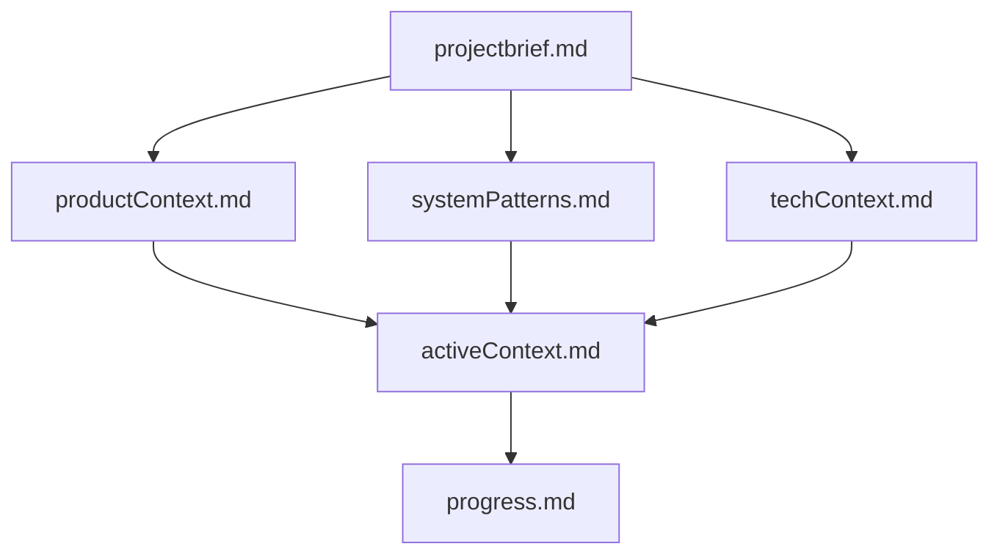

# Project information

- Relevant project information is in memory-bank directory

## Memory Bank Structure

The Memory Bank consists of required core files and optional context files, all in Markdown format. Files build upon each other in a clear hierarchy:

### Core Files (Required)
1. `projectbrief.md`
   - Foundation document that shapes all other files
   - Created at project start if it doesn't exist
   - Defines core requirements and goals
   - Source of truth for project scope

2. `productContext.md`
   - Why this project exists
   - Problems it solves
   - How it should work
   - User experience goals

3. `activeContext.md`
   - Current work focus
   - Recent changes
   - Next steps
   - Active decisions and considerations

4. `systemPatterns.md`
   - System architecture
   - Key technical decisions
   - Design patterns in use
   - Component relationships

5. `techContext.md`
   - Technologies used
   - Development setup
   - Technical constraints
   - Dependencies

6. `progress.md`
   - What works
   - What's left to build
   - Current status
   - Known issues

### Additional Context
Create additional files/folders within memory-bank/ when they help organize:
- Complex feature documentation
- Integration specifications
- API documentation
- Testing strategies
- Deployment procedures

- understanding deployment and docker- Dockerfile and restart_docker.sh

# Fundamental Principles
- Write clean, simple, readable code
- Implement features in the simplest possible way
- Keep files small and focused (<200 lines)
- Test after every meaningful change
- Focus on core functionality before optimization
- Use clear, consistent naming
- Think thoroughly before coding. Write 2-3 reasoning paragraphs.
- ALWAYS write simple, clean and modular code.
- Use clear and easy-to-understand language, write in short sentences.

# Error Fixing
- DO NOT JUMP TO CONCLUSIONS! Consider multiple possible causes before deciding.
- Explain the problem in plain English
- Make minimal necessary changes, changing as few lines of code as possible
- In case of strange errors, ask the user to perform a Perplexity web search to find up-to-date information

# Building Process
- Verify each new feature works by telling the user how to test it
- DO NOT write complicated and confusing code. Opt for the simple & modular approach.
- When not sure what to do, tell the user to perform a web search

# Thinking patterns
When you create implementation plan- make it very specific and precise- with numbered steps and very precise description what to change and why

## Thinking patterns
- think on how you are confident on solution
- If you are confident less than 7/10 on solution, ask what more information you need
- If you are not confident on solution, ask for more context
- if you are unsure about solution, ask a question for clarification

think step by step, but only keep a minimum draft for each thinking step, with 5 words ar most. Return the answer at the end of the response after a separator ####

