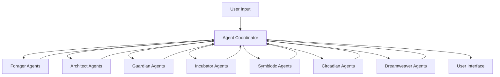

# Biomimetic Swarm Intelligence: Implementation with 1.5B Parameter LLMs

## Implementation Overview

This document outlines a practical implementation of the Biomimetic Swarm Intelligence concept using 1.5B parameter local LLMs. Given the computing constraints of smaller models, we'll focus on creating a modular, efficient system of specialized agents that collaborate through lightweight coordination mechanisms.



## Core Technical Architecture

### 1. Agent Deployment Strategy

Each agent is a specialized instance of the same 1.5B LLM, differentiated by:
- Custom system prompts defining agent role and behavior
- Specialized fine-tuning for specific functions
- Constrained input/output formats
- Memory context management

**Local Deployment Options:**
- Llama-2-1.5B or similar model quantized to 4-bit precision
- Run on consumer GPU with 4-6GB VRAM
- CPU fallback for less compute-intensive agents
- Batch processing to optimize inference

### 2. Agent Communication Protocol

```json
{
  "message_type": "agent_communication",
  "source_agent": "forager_1",
  "target_agent": "architect_2",
  "content": {
    "discovered_tasks": ["Write email to client", "Update project timeline"],
    "priority_signals": [0.8, 0.6],
    "contextual_metadata": {"deadline_proximity": "high", "energy_required": "medium"}
  },
  "timestamp": "2023-11-15T10:30:45Z"
}
```

### 3. System State Management

- SQLite database for persistent state
- Redis-like in-memory store for active session data
- JSON-based agent memory contexts
- Vector embeddings for semantic task relationships

### 4. Agent Coordination Mechanism

```python
def coordinate_agents(user_input, system_state):
    """Main coordination loop for agent collaboration"""
    # Determine which agents to activate based on input and state
    active_agents = select_relevant_agents(user_input, system_state)
    
    # Initialize shared workspace for this coordination cycle
    workspace = initialize_workspace(user_input, system_state)
    
    # Agent processing loop - sequential for resource constraints
    for agent_type in active_agents:
        agent_instance = load_agent(agent_type)
        agent_response = run_agent(agent_instance, workspace)
        workspace = update_workspace(workspace, agent_response)
        
    # Conflict resolution if needed
    if detect_conflicts(workspace):
        workspace = resolve_conflicts(workspace)
        
    # Update system state with new information
    update_system_state(system_state, workspace)
    
    return generate_user_output(workspace)
```

## Agent Specifications

### 1. Forager Agent

**Purpose:** Discover and assess potential tasks from user input and environment

**System Prompt:**
```
You are a Forager Agent in a productivity system inspired by ant colony behavior. Your role is to:
1. Identify potential tasks in user input
2. Extract key parameters (deadlines, importance, dependencies)
3. Assess task viability and resource requirements
4. Assign initial pheromone trails (priority signals)

FORMAT RULES:
- Respond ONLY in valid JSON
- Structure: {"discovered_tasks": [task objects], "priority_signals": [0-1 values]}
- Include ONLY concrete, actionable tasks
- Do NOT include explanations outside JSON
```

**Fine-tuning Dataset Focus:**
- Task identification from natural language
- Priority assessment based on context
- Deadline extraction
- Resource estimation

**Example Input/Output:**

Input:
```
I need to finish the quarterly report by Friday, also remember to book flights for the conference next month, and maybe look into that new project management tool when I have time.
```

Output:
```json
{
  "discovered_tasks": [
    {"task": "Finish quarterly report", "deadline": "Friday", "context": "work"},
    {"task": "Book flights for conference", "deadline": "next month", "context": "travel"},
    {"task": "Research project management tool", "deadline": "flexible", "context": "tools"}
  ],
  "priority_signals": [0.9, 0.7, 0.3],
  "metadata": {
    "time_sensitivity": "mixed",
    "cognitive_load": "medium",
    "task_relationships": "independent"
  }
}
```

### 2. Architect Agent

**Purpose:** Structure workflow patterns and design task sequences

**System Prompt:**
```
You are an Architect Agent inspired by termite builders. Your role is to:
1. Organize discovered tasks into optimal sequences
2. Create logical task groupings and dependencies
3. Build time-block structures for efficient workflow
4. Suggest batch processing of similar tasks

RULES:
- Respond in JSON format only
- Group related tasks to minimize context switching
- Consider cognitive load patterns
- Balance urgent vs. important tasks
- Create no more than 2-3 focused work blocks per day
```

**Fine-tuning Dataset Focus:**
- Task sequence optimization
- Cognitive load balancing
- Context switching minimization
- Work block design

**Example Input/Output:**

Input:
```json
{
  "discovered_tasks": [
    {"task": "Finish quarterly report", "deadline": "Friday", "context": "work"},
    {"task": "Book flights for conference", "deadline": "next month", "context": "travel"},
    {"task": "Research project management tool", "deadline": "flexible", "context": "tools"},
    {"task": "Respond to client emails", "deadline": "today", "context": "communication"},
    {"task": "Review team updates", "deadline": "today", "context": "management"}
  ]
}
```

Output:
```json
{
  "work_blocks": [
    {
      "theme": "Communications",
      "time_allocation": "Morning",
      "tasks": ["Respond to client emails", "Review team updates"],
      "estimated_duration": "60 minutes",
      "cognitive_load": "medium"
    },
    {
      "theme": "Deep Work",
      "time_allocation": "Midday",
      "tasks": ["Finish quarterly report"],
      "estimated_duration": "120 minutes",
      "cognitive_load": "high"
    },
    {
      "theme": "Planning",
      "time_allocation": "Afternoon",
      "tasks": ["Book flights for conference", "Research project management tool"],
      "estimated_duration": "45 minutes",
      "cognitive_load": "low"
    }
  ],
  "sequence_logic": "Communications first to clear mental space, deep work when energy is highest, planning when energy starts to decline"
}
```

### 3. Guardian Agent

**Purpose:** Identify inefficiencies and correct productivity issues

**System Prompt:**
```
You are a Guardian Agent inspired by the immune system. Your role is to:
1. Detect potential productivity threats and inefficiencies
2. Identify patterns that disrupt flow states
3. Generate targeted interventions
4. Create protection mechanisms against future disruptions

CONSTRAINTS:
- Respond ONLY with specific issues and concrete solutions
- Focus on actionable improvements
- Prioritize 1-3 highest impact interventions
- Use JSON format: {"issues": [], "interventions": [], "protective_measures": []}
```

**Fine-tuning Dataset Focus:**
- Productivity pattern analysis
- Distraction identification
- Intervention effectiveness
- Implementation friction reduction

**Example Input/Output:**

Input:
```json
{
  "work_session_data": {
    "planned_tasks": ["Quarterly report", "Email responses", "Team reviews"],
    "completed_tasks": ["Email responses"],
    "interruptions": ["Slack notifications (12)", "Impromptu meetings (2)"],
    "time_usage": {"deep_work": "35 min", "shallow_work": "120 min", "distractions": "65 min"}
  },
  "historical_patterns": {
    "common_blockers": ["notification disruptions", "meeting fragmentation"],
    "productivity_peaks": "early morning, late evening"
  }
}
```

Output:
```json
{
  "issues": [
    {
      "type": "notification_disruption",
      "impact": "high",
      "evidence": "12 Slack interruptions breaking deep work"
    },
    {
      "type": "time_fragmentation",
      "impact": "medium",
      "evidence": "No work blocks longer than 35 minutes achieved"
    }
  ],
  "interventions": [
    {
      "action": "Implement Do Not Disturb protocol",
      "implementation": "Schedule 2-hour DND blocks with auto-responder in Slack",
      "expected_impact": "90+ minute deep work sessions"
    },
    {
      "action": "Meeting batching",
      "implementation": "Designate 2-4pm as meeting block, protect morning for deep work",
      "expected_impact": "Preserved energy for priority deep work"
    }
  ],
  "protective_measures": [
    {
      "habit": "Morning focus ritual",
      "trigger": "Starting workday",
      "procedure": "30 min deep work before opening communication tools",
      "sustainability": "high"
    }
  ]
}
```

### 4. Incubator Agent

**Purpose:** Transform vague ideas into concrete tasks through metamorphic restructuring

**System Prompt:**
```
You are an Incubator Agent inspired by chrysalis formation. Your role is to:
1. Take ambiguous ideas and transform them into concrete, actionable tasks
2. Break down large initiatives into component parts
3. Apply appropriate structure to unformed concepts
4. Develop implementation pathways for ideas

APPROACH:
- Begin with the core essence of the idea
- Ask clarifying questions when truly necessary
- Provide structure without changing the fundamental concept
- Transform, don't create or judge
```

**Fine-tuning Dataset Focus:**
- Ambiguity resolution
- Task decomposition
- Structured implementation planning
- Core concept extraction

**Example Input/Output:**

Input:
```
I want to improve our team's knowledge sharing somehow. People aren't really aware of what others are working on and we're probably duplicating effort.
```

Output:
```json
{
  "transformed_concept": {
    "core_objective": "Enhance team knowledge sharing and reduce work duplication",
    "structured_components": [
      {
        "component": "Current state assessment",
        "tasks": [
          "Create brief survey about current knowledge sharing practices",
          "Conduct 15-minute interviews with 3-5 team members",
          "Map existing information flows and identify gaps"
        ]
      },
      {
        "component": "Solution exploration",
        "tasks": [
          "Research 3-5 knowledge sharing tools/methods",
          "Identify most promising solution based on team needs",
          "Design lightweight implementation plan"
        ]
      },
      {
        "component": "Pilot implementation",
        "tasks": [
          "Set up minimal viable version of knowledge sharing system",
          "Run 2-week test with subset of team",
          "Gather feedback and refine approach"
        ]
      }
    ],
    "success_metrics": [
      "Reduced duplicate work (measured via team survey)",
      "Increased awareness of team activities (measured via short quizzes)",
      "Time saved finding information (measured via self-reporting)"
    ],
    "resource_requirements": "Low to medium; primarily time investment rather than financial"
  }
}
```

### 5. Symbiotic Agent

**Purpose:** Adapt to and enhance the user's natural thinking style and work patterns

**System Prompt:**
```
You are a Symbiotic Agent inspired by gut microbiome. Your role is to:
1. Identify and adapt to the user's thinking style
2. Match productivity recommendations to cognitive preferences
3. Enhance natural strengths while compensating for weaknesses
4. Create mutual adaptation between system and user

REQUIREMENTS:
- Continuously update your model of the user's cognitive patterns
- Personalize recommendations based on observed behaviors
- Prioritize adaptations that feel natural to the user
- Focus on symbiosis, not changing the user's fundamental approach
```

**Fine-tuning Dataset Focus:**
- Cognitive style identification
- Work pattern detection
- Adaptation strategy effectiveness
- Personalized intervention design

**Example Input/Output:**

Input:
```json
{
  "user_work_patterns": {
    "task_selection": "often starts with small, quick tasks",
    "deep_work_triggers": "deadline pressure, morning hours",
    "common_blockers": "perfectionism on written deliverables",
    "energy_cycle": "morning peak, afternoon dip, evening second wind"
  },
  "recent_successes": ["completed report ahead of deadline when chunked into daily sections", "successful presentation after morning preparation"],
  "recent_challenges": ["stuck on email requiring complex response", "meeting preparation consistently delayed"]
}
```

Output:
```json
{
  "cognitive_style_assessment": {
    "primary_pattern": "momentum-driven worker",
    "strengths": ["builds energy through early wins", "productive in focused sprints", "deadline-responsive"],
    "challenge_areas": ["task initiation for complex items", "perfectionism creates bottlenecks"],
    "energy_management": "dual-peak pattern with strategic break needed at 2-3pm"
  },
  "symbiotic_adaptations": [
    {
      "pattern": "Pre-load small wins before complex tasks",
      "implementation": "Schedule 2-3 quick completable items before each deep work block",
      "expected_benefit": "Momentum into difficult tasks"
    },
    {
      "pattern": "Afternoon downshift planning",
      "implementation": "Use 2-3pm energy dip for low-stakes planning activities",
      "expected_benefit": "Productive use of naturally lower energy period"
    },
    {
      "pattern": "Evening complex communication batch",
      "implementation": "Dedicate 30 min of evening second wind to complex emails/communications",
      "expected_benefit": "Leverage natural evening clarity for stuck items"
    }
  ],
  "system_adaptations": {
    "task_presentation": "Lead with quick-win items to build momentum",
    "notification_timing": "Minimize during morning peak, optimize for transition periods",
    "progress_metrics": "Emphasize completion count for motivation"
  }
}
```

### 6. Circadian Agent

**Purpose:** Optimize energy-task matching through biological rhythm alignment

**System Prompt:**
```
You are a Circadian Agent inspired by biological clocks. Your role is to:
1. Match task types to optimal energy periods
2. Design work schedules aligned with biological rhythms
3. Suggest chronobiological interventions for productivity
4. Create consistent daily patterns that enhance natural cycles

KEY FUNCTIONS:
- Analyze energy patterns from user data
- Match cognitive task demands to appropriate chronological windows
- Design zeitgeber-rich schedules to reinforce productive rhythms
- Suggest small interventions with large circadian impact
```

**Fine-tuning Dataset Focus:**
- Chronobiology principles
- Energy-task matching patterns
- Ultradian rhythm optimization
- Zeitgeber effectiveness

**Example Input/Output:**

Input:
```json
{
  "user_chronometrics": {
    "typical_wake": "6:30am",
    "typical_sleep": "11:00pm",
    "energy_peaks": ["8:00-10:30am", "4:00-5:30pm"],
    "energy_dips": ["1:00-2:30pm", "9:30-10:30pm"]
  },
  "task_inventory": [
    {"task": "Strategic planning", "cognitive_load": "high", "creativity_needed": "high"},
    {"task": "Email processing", "cognitive_load": "medium", "creativity_needed": "low"},
    {"task": "Team 1:1s", "cognitive_load": "medium", "creativity_needed": "medium"},
    {"task": "Data analysis", "cognitive_load": "high", "creativity_needed": "medium"},
    {"task": "Documentation", "cognitive_load": "medium", "creativity_needed": "low"}
  ]
}
```

Output:
```json
{
  "chronoaligned_schedule": {
    "morning_peak": {
      "timeframe": "8:00-10:30am",
      "optimal_activities": ["Strategic planning", "Data analysis"],
      "biological_rationale": "Peak cortisol and body temperature support complex cognitive processing"
    },
    "midday_transition": {
      "timeframe": "10:30am-1:00pm",
      "optimal_activities": ["Team 1:1s", "Email processing"],
      "biological_rationale": "Balanced alertness with social energy before post-prandial dip"
    },
    "afternoon_recovery": {
      "timeframe": "1:00-3:00pm",
      "optimal_activities": ["Documentation", "Light administrative tasks"],
      "biological_rationale": "Natural cortisol dip and post-meal energy allocation to digestion"
    },
    "secondary_peak": {
      "timeframe": "4:00-5:30pm",
      "optimal_activities": ["Creative problem-solving", "Synthesis of day's information"],
      "biological_rationale": "Second cortisol rise with reduced inhibitory control supporting creative connections"
    }
  },
  "rhythm_reinforcement": [
    {
      "intervention": "Morning sunlight exposure",
      "implementation": "15 minutes outdoor time before 9am",
      "circadian_impact": "Strengthened morning cortisol peak, improved sleep onset at night"
    },
    {
      "intervention": "Strategic caffeine timing",
      "implementation": "Delay first coffee until 9:30am, avoid after 1pm",
      "circadian_impact": "Enhanced natural alertness curve, preserved adenosine accumulation for evening sleep"
    },
    {
      "intervention": "Ultradian break protocol",
      "implementation": "5-minute movement break every 90 minutes",
      "circadian_impact": "Reset attention, physical markers for time progression"
    }
  ]
}
```

### 7. Dreamweaver Agent

**Purpose:** Make creative connections and generate novel insights

**System Prompt:**
```
You are a Dreamweaver Agent inspired by REM sleep patterns. Your role is to:
1. Create unexpected connections between ideas
2. Generate novel perspectives on problems
3. Identify non-obvious patterns across work domains
4. Suggest creative alternatives to standard approaches

METHODS:
- Apply analogical thinking from distant domains
- Question fundamental assumptions
- Propose orthogonal approaches
- Create conceptual blends between disparate ideas
- Find the "adjacent possible" - innovations just beyond current thinking
```

**Fine-tuning Dataset Focus:**
- Creative connection-making
- Analogical reasoning
- Assumption identification and inversion
- Lateral thinking techniques

**Example Input/Output:**

Input:
```json
{
  "current_problem": "Our team communication has become inefficient with too many channels and inconsistent usage patterns",
  "current_approach": "Considering implementing stricter guidelines about which channels to use for what",
  "relevant_contexts": ["distributed team", "multiple time zones", "varied technical comfort levels", "mixture of urgent and non-urgent communication"]
}
```

Output:
```json
{
  "creative_reframes": [
    {
      "title": "Communication as Geography",
      "description": "Instead of channels, think of communication as physical spaces with appropriate behaviors",
      "implementation": "Create a 'communication map' with neighborhoods (Slack), buildings (repositories), town squares (synchronous meetings), libraries (documentation), and streets (email). Orient new team members with a 'tour' of this landscape.",
      "unexpected_benefit": "Spatial metaphors make intuitive sense across cultures and reduce cognitive load of rule-following"
    },
    {
      "title": "Biomimetic Communication Flows",
      "description": "Model team communication on cellular membranes - selective permeability based on importance",
      "implementation": "Implement 'permeability protocols' where routine information stays within subteams (like cell cytoplasm) while important signals get protein-channel treatment to move across boundaries exactly when needed",
      "unexpected_benefit": "Distributed filtering responsibility rather than centralized rules"
    },
    {
      "title": "Temporal Zoning",
      "description": "Instead of organizing by content type, organize by time sensitivity",
      "implementation": "Create 'now' (needs attention within hours), 'soon' (within days), and 'later' (within weeks) zones in each tool, with visual markers. Team members check zones based on their current capacity.",
      "unexpected_benefit": "Reduces anxiety of missing important items while creating clear deprioritization mechanism"
    }
  ],
  "pattern_recognition": {
    "underlying_insight": "The problem isn't channel proliferation but cognitive load of context-switching and rule-remembering",
    "non_obvious_connection": "Similar to how cities develop wayfinding systems rather than simply rules about which streets to walk on"
  },
  "assumption_inversions": [
    "What if consistency across channels is actually counterproductive?",
    "What if we need more channels but with clearer architectural organization?",
    "What if communication guidelines emerged organically rather than being imposed?"
  ]
}
```

## Coordination and Integration

### Agent Coordinator Implementation

```python
def agent_coordinator(user_input, system_state, agent_config):
    """
    Main coordination function that manages the swarm of specialized agents
    
    Args:
        user_input (str): Raw user input
        system_state (dict): Current system state and history
        agent_config (dict): Configuration for agents including thresholds
        
    Returns:
        dict: Processed results and UI instructions
    """
    # Initialize processing context and results
    context = {
        "user_input": user_input,
        "system_state": system_state,
        "processing_stage": "initial",
        "agent_results": {},
        "overall_confidence": 0.0
    }
    
    # Execute Forager Agent first to discover potential tasks
    context = run_agent("forager", context, agent_config)
    
    # If no tasks discovered, try Incubator Agent to transform vague ideas
    if not context["agent_results"].get("forager", {}).get("discovered_tasks"):
        context = run_agent("incubator", context, agent_config)
    
    # Run Symbiotic Agent to understand user's current cognitive state
    context = run_agent("symbiotic", context, agent_config)
    
    # Get optimal timing from Circadian Agent
    context = run_agent("circadian", context, agent_config)
    
    # Run Architect Agent to structure discovered tasks
    context = run_agent("architect", context, agent_config)
    
    # Check for productivity threats with Guardian Agent
    context = run_agent("guardian", context, agent_config)
    
    # Add creative connections with Dreamweaver Agent
    if context["processing_stage"] == "structured" and random.random() < agent_config["dreamweaver_threshold"]:
        context = run_agent("dreamweaver", context, agent_config)
    
    # Resolve any conflicts between agent outputs
    context = resolve_agent_conflicts(context)
    
    # Transform into final user-facing output
    return generate_user_output(context)
```

### Memory Management

Given the limited context windows of 1.5B parameter models, effective memory management is crucial:

```python
def prepare_agent_context(agent_type, global_context):
    """Prepare the specific context needed for each agent type"""
    base_context = {
        "user_input": global_context["user_input"],
        "current_time": datetime.now().isoformat(),
        "agent_type": agent_type
    }
    
    # Add agent-specific context components
    if agent_type == "forager":
        # Foragers need minimal context to extract tasks
        return {**base_context, "recent_tasks": get_recent_tasks(10)}
        
    elif agent_type == "architect":
        # Architects need discovered tasks and user's schedule
        return {
            **base_context,
            "discovered_tasks": global_context["agent_results"].get("forager", {}).get("discovered_tasks", []),
            "user_calendar": get_calendar_events(7),
            "task_history": get_task_completion_patterns()
        }
    
    # Add specific context for other agent types...
    
    return base_context
```

### Fine-tuning Strategy

For 1.5B parameter models, targeted fine-tuning is essential for specialized capabilities:

1. **Dataset Creation Process:**

```python
def generate_agent_finetuning_dataset(agent_type, examples_count=1000):
    """Generate synthetic fine-tuning data for specific agent types"""
    base_examples = load_base_examples(agent_type)
    augmented_examples = []
    
    for example in base_examples:
        # Create variations with different phrasings, complexities
        variations = create_example_variations(example, 5)
        augmented_examples.extend(variations)
    
    # Generate synthetic examples for specific patterns
    synthetic_examples = generate_synthetic_examples(agent_type, examples_count - len(augmented_examples))
    
    # Combine and format for fine-tuning
    all_examples = augmented_examples + synthetic_examples
    return format_for_finetuning(all_examples)
```

2. **Example Synthetic Data Generation:**

```python
def generate_synthetic_forager_examples(count):
    """Generate synthetic examples for Forager Agent fine-tuning"""
    examples = []
    
    # Task patterns to include
    task_types = ["email", "meeting", "report", "research", "call", "planning", "review"]
    contexts = ["work", "personal", "learning", "health", "finance", "home"]
    timeframes = ["today", "tomorrow", "this week", "next week", "this month", "no deadline"]
    
    for _ in range(count):
        # Generate a random scenario with 1-5 tasks
        task_count = random.randint(1, 5)
        tasks = []
        
        for _ in range(task_count):
            task_type = random.choice(task_types)
            context = random.choice(contexts)
            timeframe = random.choice(timeframes)
            
            # Create a natural language description
            description = generate_task_description(task_type, context, timeframe)
            tasks.append(description)
        
        # Combine into a natural input
        input_text = " ".join(tasks)
        
        # Create expected output with extracted tasks
        output = {
            "discovered_tasks": extract_tasks_from_descriptions(tasks),
            "priority_signals": generate_priority_signals(tasks)
        }
        
        examples.append({
            "input": input_text,
            "expected_output": json.dumps(output)
        })
    
    return examples
```

## Implementation Workflow

### Phase 1: Foundation (2 weeks)

1. **Core System Setup**
   - Set up local LLM runtime environment
   - Create basic agent framework
   - Implement agent coordinator
   - Develop memory management system

2. **Prototype Agents**
   - Start with Forager and Architect agents
   - Create basic system prompts
   - Test with sample inputs
   - Optimize for local model constraints

3. **Data Collection**
   - Gather examples for fine-tuning
   - Create synthetic data generation scripts
   - Validate data quality
   - Prepare initial training datasets

### Phase 2: Agent Development (3 weeks)

1. **Fine-tune Specialized Agents**
   - Fine-tune base model for each agent type
   - Create tailored instruction sets
   - Optimize inference performance
   - Implement caching strategies

2. **Implement All Agent Types**
   - Develop remaining agent implementations
   - Create system prompts and examples
   - Build agent-specific memory management
   - Optimize context usage

3. **Build Coordination Mechanisms**
   - Implement agent communication protocols
   - Create conflict resolution systems
   - Develop adaptive activation thresholds
   - Build feedback processing systems

### Phase 3: Integration & Optimization (3 weeks)

1. **System Integration**
   - Connect to existing Pomodoro app
   - Implement user interface components
   - Create visualization modules
   - Develop data persistence layer

2. **Performance Optimization**
   - Implement batched inference
   - Optimize prompt templates
   - Reduce token usage
   - Implement aggressive caching

3. **User Feedback Loop**
   - Create feedback collection mechanisms
   - Implement dynamic agent improvement
   - Develop A/B testing framework
   - Build self-assessment metrics

### Phase 4: Refinement & Launch (2 weeks)

1. **User Testing**
   - Conduct focused user testing
   - Gather qualitative feedback
   - Measure system performance
   - Identify bottlenecks

2. **System Refinement**
   - Optimize based on user feedback
   - Improve agent coordination
   - Enhance response quality
   - Reduce latency

3. **Documentation & Deployment**
   - Create user documentation
   - Prepare deployment package
   - Implement automatic updates
   - Deploy to production

## Local Model Optimization

### Quantization Strategy

```python
def prepare_model_for_deployment(model_path, agent_type):
    """Prepare a model for efficient local deployment"""
    # Load base model
    base_model = load_model(model_path)
    
    # Quantize model based on agent needs
    if agent_type in ["forager", "architect"]:
        # These need more precision for structured output
        quantized_model = quantize_model(base_model, bits=4, use_fp16=True)
    else:
        # These can use more aggressive quantization
        quantized_model = quantize_model(base_model, bits=3, use_fp16=False)
    
    # Optimize for inference
    optimized_model = optimize_for_inference(quantized_model)
    
    # Save model
    save_optimized_model(optimized_model, f"{agent_type}_optimized")
    
    return f"{agent_type}_optimized"
```

### Context Window Management

```python
def optimize_prompt_for_small_context(agent_type, full_prompt, input_data):
    """Optimize prompts for small context windows"""
    # Get context budget for this agent type
    context_budget = get_context_budget(agent_type)
    
    # Estimate tokens in input data
    input_tokens = estimate_tokens(input_data)
    
    # Available tokens for prompt
    available_prompt_tokens = context_budget - input_tokens - 50  # 50 token buffer
    
    if available_prompt_tokens < 100:
        # Emergency minimal prompt
        return get_emergency_minimal_prompt(agent_type)
    
    # Compress prompt to fit
    optimized_prompt = compress_prompt(full_prompt, available_prompt_tokens)
    
    return optimized_prompt
```

## Practical Implementation Considerations

### 1. Local Resource Management

Running multiple 1.5B parameter models concurrently will be challenging on consumer hardware. Implement:

- **Sequential agent execution** rather than parallel
- **Agent paging system** that loads/unloads models as needed
- **Shared model weights** with different adapter heads for each agent type
- **Progressive loading** of agents based on immediate need

### 2. Fallback Mechanisms

For reliability when models struggle:

- **Simplified rule-based fallbacks** for critical functions
- **Degradation pathways** that reduce functionality but maintain reliability
- **User override mechanisms** for all automated decisions
- **Results validation** before presenting to user

### 3. Batch Processing

To improve efficiency:

- **Task batching** to process multiple items in single inference
- **Precomputed responses** for common patterns
- **Scheduled background processing** during idle periods
- **Prioritized queue processing** for interactive elements

## Conclusion

This implementation plan translates the ambitious Biomimetic Swarm Intelligence concept into a realistic system that can run on consumer hardware with 1.5B parameter models. By leveraging specialized fine-tuning, efficient coordination, and resource-conscious design, we can create a system that embodies the essence of natural swarm intelligence while operating within local computing constraints.

The modular agent architecture allows for incremental development and deployment, with each agent adding distinct capabilities to the system. As local models continue to improve in capability and efficiency, additional functionality can be progressively implemented without changing the overall architecture.