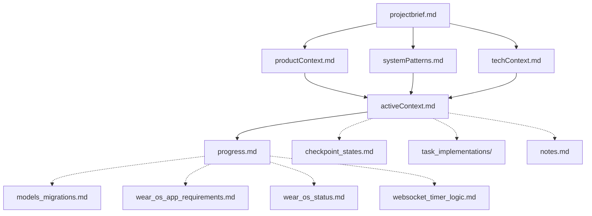

# Memory Bank

This directory contains the memory bank files for the Pomodoro TimerFlow project. These files serve as the project's documentation and knowledge base, providing context and information about the project's goals, architecture, and progress.

## Core Files

- **projectbrief.md**: Foundation document that defines core requirements and goals
- **productContext.md**: Why this project exists, problems it solves, user experience goals
- **activeContext.md**: Current work focus, recent changes, next steps, active decisions
- **systemPatterns.md**: System architecture, key technical decisions, design patterns
- **techContext.md**: Technologies used, development setup, technical constraints
- **progress.md**: What works, what's left to build, current status, known issues

## Additional Context Files

- **checkpoint_states.md**: Details about the checkpoint state system for timer sessions
- **models_migrations.md**: Documentation of the database migration system
- **wear_os_app_requirements.md**: Requirements for the Wear OS app
- **wear_os_status.md**: Current status of the Wear OS app development
- **websocket_timer_logic.md**: Documentation of the WebSocket timer logic
- **notes.md**: Miscellaneous notes and conversations

## Task Implementations

The `task_implementations/` directory contains detailed documentation of specific task implementations:

- **drag_and_drop_implementation.md**: Detailed solution for the drag-and-drop functionality

## File Relationships

## Usage

When working on the project, always start by reviewing the memory bank files to understand the current state of the project and the context of your work. The `activeContext.md` file is particularly important as it contains the current work focus and next steps.

When making significant changes to the project, update the relevant memory bank files to reflect the new state of the project. This ensures that the memory bank remains an accurate and useful resource for all team members.