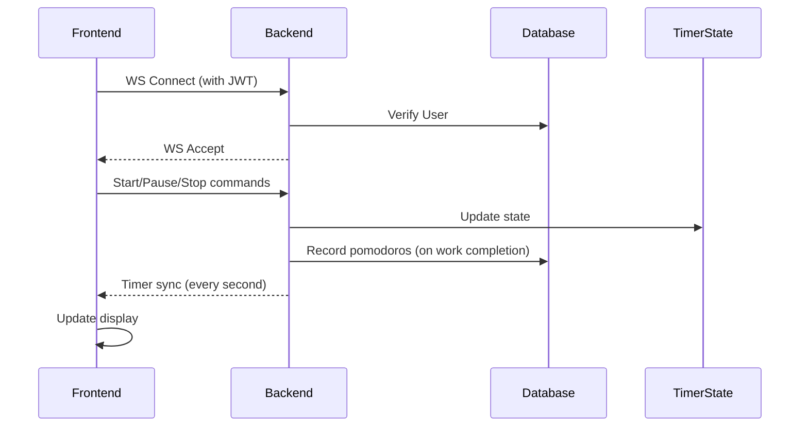

# WebSocket Timer Logic Documentation

## Architecture Overview
- Frontend (React) ↔ WebSocket ↔ Backend (FastAPI)
- State managed by ConnectionManager with TimerState objects
- Real-time sync via JSON messages

### Core Components
1. `TimerState` (backend)
   - Tracks: 
     - Session type (work/short_break/long_break)
     - Remaining time
     - Round number
     - Preset type (short/long)
     - User-specific settings
   - Handles time calculations with UTC timestamps

2. `ConnectionManager` (backend)
   - Manages WebSocket connections
   - Maintains timer states per user
   - Handles session transitions

3. `Timer` component (frontend)
   - Visualizes timer state
   - Sends control commands
   - Syncs with backend every 1s

## Workflow Diagram



## Key Features

### 1. Preset System
- Short vs Long preset configurations
- Affects durations:
  ```python
  # backend/ws_manager.py
  settings = {
    'short': {
      'work_duration': 25,
      'short_break': 5,
      'long_break': 15,
      'sessions_before_long_break': 4
    },
    'long': {
      'work_duration': 50,
      'short_break': 10,
      'long_break': 30,
      'sessions_before_long_break': 2
    }
  }
  ```

### 2. Session Transitions
```python
def skip_to_next(user_id):
    if current == 'work':
        if round % settings[preset]['sessions_before_long_break'] == 0:
            next = 'long_break'
        else:
            next = 'short_break'
    else:
        next = 'work'
        update_round_number()
```

### 3. Time Synchronization
- Server-authoritative time calculation:
  ```python
  def get_remaining_time(self):
      elapsed = (now - self.last_update).total_seconds()
      return max(0, self.time_remaining - elapsed)
  ```

### 4. Task Integration
- Links timer sessions to tasks
- Updates `completed_pomodoros` count:
  ```python
  if session_type == 'work':
      task.completed_pomodoros += 1
      db.commit()
  ```

## Potential Risk Areas

1. **Time Drift**
   - Client-server clock mismatch
   - Mitigation: UTC timestamps on server

2. **Race Conditions**
   - Concurrent state modifications
   - Current protection: Single TimerState per user

3. **Preset Transition Edge Cases**
   - Changing presets mid-session
   - Partial solution: 
     ```python
     def change_preset():
         if session == 'work':
             time = settings[new_preset]['work']
         # ... other session types
     ```

## Recommended Improvements

1. **Add Session History**
   ```python
   class TimerState:
       def __init__(self):
           self.history = []  # Track completed sessions
   ```

2. **Implement Graceful Degradation**
   - Local timer fallback if WS disconnected
   - Sync mechanism when reconnected

3. **Enhanced Validation**
   ```python
   def start_timer():
       if not validate_task_exists(task_id):
           raise InvalidTaskError
   ```

4. **Preset Transition Guard**
   ```python
   def can_change_preset(current_state):
       return current_state.is_paused or current_state.time_remaining < 60
   ```

5. **Improved Error Logging**
   ```python
   # ws_manager.py
   logger.error(f"Timer error for {user_id}", 
                exc_info=True,
                extra={"state": state.dump()})


# Pomodoro Timer Logic: Backend and Frontend Implementation

## Overview

The Pomodoro TimerFlow application implements a robust timer system with real-time synchronization across devices. The timer logic is primarily maintained on the backend, ensuring consistency across all connected clients. The system uses WebSockets for bidirectional communication, allowing instant updates and a seamless user experience.

## Backend Implementation

### Core Components

#### TimerState Class (`ws_manager.py`)

```python
class TimerState:
    def __init__(self, task_id, session_type, time_remaining, user_settings, preset_type="short"):
        self.task_id = task_id
        self.session_type = session_type  # 'work', 'short_break', or 'long_break'
        self.time_remaining = time_remaining
        self.is_paused = True
        self.last_update = datetime.now(timezone.utc)
        self.round_number = 1  # Track which round in the cycle (1-4)
        self.preset_type = preset_type  # 'short' or 'long'
        self.settings = user_settings
        self.active_task = None
        self.session_completed = False
```

The `TimerState` maintains:
- Current session type (work/short break/long break)
- Time remaining in seconds
- Whether timer is paused
- Last time update occurred (for time calculations)
- Current round number (for long break determination)
- Active preset type (short/long)
- User settings for durations
- Active task information
- Session completion flag

#### ConnectionManager Class (`ws_manager.py`)

```python
class ConnectionManager:
    def __init__(self):
        self.active_connections: Dict[str, Set[WebSocket]] = {}
        self.timer_states: Dict[str, TimerState] = {}
        self.db: Optional[Session] = None
```

The `ConnectionManager`:
- Maintains active WebSocket connections for each user
- Stores timer states for all users
- Provides methods to manage connections and timer states
- Broadcasts updates to all connected devices for a user

### Timer Logic Flow

1. **Time Tracking**
   - The `update_remaining_time()` method calculates elapsed time since last update
   - Time is decremented based on actual elapsed seconds since the last update
   - This ensures accurate timing regardless of sync frequency

2. **Session Transitions**
   - When a timer reaches zero, `handle_session_completion()` is called
   - For work sessions, the task's completed_pomodoros is incremented
   - The method `skip_to_next()` determines the next session type:
     - After work: Either short_break or long_break (depending on round number)
     - After breaks: Always work
   - Round numbers increment after each short break
   - Round resets to 1 after a long break

3. **Preset Handling**
   - Each user has settings for both short and long presets
   - Default short preset: 25min work, 5min break, 15min long break
   - Default long preset: 50min work, 10min break, 30min long break
   - Session durations are updated when preset changes

## Frontend Implementation

### useWebSocket Hook (`useWebSocket.js`)

```javascript
export default function useWebSocket(token) {
  const [ws, setWs] = useState(null);
  const [isConnected, setIsConnected] = useState(false);
  const reconnectAttempt = useRef(0);
  // ...
```

This custom hook:
- Establishes and maintains WebSocket connection
- Handles reconnection attempts with exponential backoff
- Provides interface for sending messages
- Tracks connection status

### Timer Component (`Timer.js`)

```javascript
export default function Timer({ currentTask, currentPreset, setCurrentPreset, settings, ws, setTimerCountdown }) {
  const [timeLeft, setTimeLeft] = useState(25 * 60);
  const [isRunning, setIsRunning] = useState(false);
  const [sessionType, setSessionType] = useState('work');
  const [roundNumber, setRoundNumber] = useState(1);
  // ...
```

The Timer component:
- Renders the timer UI with controls
- Maintains local state that mirrors the backend state
- Sends WebSocket commands for timer actions
- Updates UI based on WebSocket messages
- Supports preset switching and session management

## Communication Protocol

### WebSocket Messages

1. **Frontend to Backend**:
   - `start`: Start a new timer session
   - `stop`: Stop the timer
   - `pause`: Pause the running timer
   - `resume`: Resume a paused timer
   - `sync_request`: Request current timer state
   - `skip_to_next`: Skip to next session
   - `reset_rounds`: Reset round counter
   - `change_preset`: Switch between short/long presets
   - `set_timezone`: Set client timezone offset

2. **Backend to Frontend**:
   - `timer_sync`: Current timer state update
   - `timer_stopped`: Notification that timer was stopped
   - `session_ended`: Notification that session completed
   - `rounds_reset`: Notification that rounds were reset

### Sync Flow

1. Connection established
2. Frontend sends `sync_request`
3. Backend sends `timer_sync` with current state
4. Frontend updates UI based on state
5. Frontend periodically requests sync updates (every 1s)
6. Backend calculates and sends current time remaining

## Automatic Features

1. **Session Auto-Transition**:
   - When a session completes, automatically transitions to next session type
   - Work → Short/Long Break → Work → etc.

2. **Task Completion Tracking**:
   - After each work session, increments the task's completed_pomodoros count

3. **Daily Reset**:
   - A daily reset feature resets timer at 5 AM local time
   - Uses client timezone offset to determine correct reset time

4. **Multi-Device Sync**:
   - All devices connected with the same user account stay in sync
   - Start/stop/pause actions on one device affect all devices

## Potential Bugs and Improvements

### Potential Bugs

1. **Timer Drift**: Long-running timers might drift due to timestamp-based calculation
2. **Connection Issues**: Temporary disconnections may cause sync problems
3. **Race Conditions**: Multiple devices sending commands simultaneously could cause state inconsistencies
4. **Initialization Issues**: Timer component doesn't handle initial sync failures gracefully

### Improvement Opportunities

1. **Local Backup Timer**: Frontend could run a local timer as backup during disconnections
2. **Improved Error Handling**: More robust handling of WebSocket errors and edge cases
3. **Performance Optimization**: Reduce sync frequency during inactive periods
4. **UI Feedback**: Better visual indicators for connection status
5. **Offline Support**: Limited offline functionality with sync on reconnection
6. **Browser Notifications**: Implement notifications when sessions complete
7. **Sound Alerts**: Add configurable sound alerts for session transitions
8. **Intelligent Reconnection**: More sophisticated reconnection strategy for unstable connections

## Conclusion

The Pomodoro timer implementation uses a server-centric approach where the backend maintains the source of truth for the timer state. This ensures consistency across devices and provides a reliable experience even with multiple clients. The WebSocket-based communication allows for real-time updates and smooth transitions between work and break sessions.