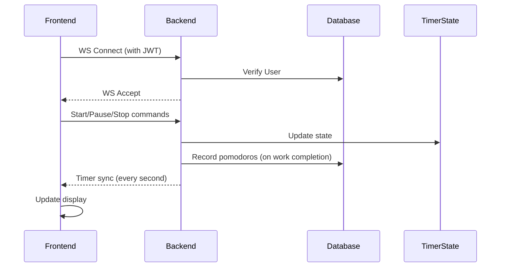

# WebSocket Timer Logic Documentation

## Architecture Overview

Frontend (React) ↔ WebSocket ↔ Backend (FastAPI)
State managed by ConnectionManager with TimerState objects
Real-time sync via JSON messages

## Core Components

### TimerState (backend)

Tracks:

*   Session type (work/short_break/long_break)
*   Remaining time
*   Round number
*   Preset type (short/long)
*   User-specific settings

Handles time calculations with UTC timestamps

### ConnectionManager (backend)

Manages WebSocket connections
Maintains timer states per user
Handles session transitions

### Timer component (frontend)

Visualizes timer state
Sends control commands
Syncs with backend every 1s

## Workflow Diagram



## Key Features

### 1. Preset System

Short vs Long preset configurations
Affects durations:

```python
# backend/ws_manager.py
settings = {
  'short': {
    'work_duration': 25,
    'short_break': 5,
    'long_break': 15,
    'sessions_before_long_break': 4
  },
  'long': {
    'work_duration': 50,
    'short_break': 10,
    'long_break': 30,
    'sessions_before_long_break': 2
  }
}
```

### 2. Session Transitions

```python
def skip_to_next(user_id):
    if current == 'work':
        if round % settings[preset]['sessions_before_long_break'] == 0:
            next = 'long_break'
        else:
            next = 'short_break'
    else:
        next = 'work'
        update_round_number()
```

### 3. Time Synchronization

Server-authoritative time calculation:

```python
def get_remaining_time(self):
    elapsed = (now - self.last_update).total_seconds()
    return max(0, self.time_remaining - elapsed)
```

### 4. Task Integration

Links timer sessions to tasks
Updates completed_pomodoros count:

```python
if session_type == 'work':
    task.completed_pomodoros += 1
    db.commit()
```

## Potential Risk Areas

### Time Drift

Client-server clock mismatch
Mitigation: UTC timestamps on server

### Race Conditions

Concurrent state modifications
Current protection: Single TimerState per user

### Preset Transition Edge Cases

Changing presets mid-session
Partial solution:

```python
def change_preset():
    if session == 'work':
        time = settings[new_preset]['work']
    # ... other session types
```

## Recommended Improvements

### Add Session History

```python
class TimerState:
    def __init__(self):
        self.history = []  # Track completed sessions
```

### Implement Graceful Degradation

Local timer fallback if WS disconnected
Sync mechanism when reconnected

### Enhanced Validation

```python
def start_timer():
    if not validate_task_exists(task_id):
        raise InvalidTaskError
```

### Preset Transition Guard

```python
def can_change_preset(current_state):
    return current_state.is_paused or current_state.time_remaining < 60
```

### Improved Error Logging

```python
# ws_manager.py
logger.error(f"Timer error for {user_id}", 
             exc_info=True,
             extra={"state": state.dump()})
```

## Frontend Implementation Details

### WebSocket Hook

```javascript
// useWebSocket.js
export default function useWebSocket(token) {
  const [ws, setWs] = useState(null);
  const [isConnected, setIsConnected] = useState(false);
  const reconnectAttempt = useRef(0);
  const MAX_RECONNECT_ATTEMPTS = 5;
  const RECONNECT_INTERVAL = 2000;

  const connectWebSocket = useCallback(() => {
    if (!token) return;

    try {
      // Close existing connection if any
      if (wsRef.current) {
        wsRef.current.close();
      }

      const wsUrl = `${apiConfig.baseUrl.replace('http', 'ws')}/ws/?token=${token}`;
      const websocket = new WebSocket(wsUrl);

      websocket.onopen = () => {
        console.log('WebSocket Connected');
        setIsConnected(true);
        reconnectAttempt.current = 0;
        wsRef.current = websocket;
        setWs(websocket);

        // Request initial timer state sync
        websocket.send(JSON.stringify({
          type: 'sync_request'
        }));
      };

      // Error and reconnection handling logic...
    } catch (error) {
      console.error('Error setting up WebSocket:', error);
      return null;
    }
  }, [token]);

  // Effect hooks for connection management...

  return {
    ws,
    isConnected,
    reconnect: connectWebSocket
  };
}
```

### Timer Component

```javascript
// Timer.js (simplified)
export default function Timer({ currentTask, currentPreset, setCurrentPreset, settings, ws, setTimerCountdown }) {
  const [timeLeft, setTimeLeft] = useState(25 * 60);
  const [isRunning, setIsRunning] = useState(false);
  const [sessionType, setSessionType] = useState('work');
  const [roundNumber, setRoundNumber] = useState(1);

  // Handle WebSocket messages
  useEffect(() => {
    if (!ws) return;

    ws.onmessage = (event) => {
      const data = JSON.parse(event.data);

      if (data.type === 'timer_sync') {
        const { preset_type, ...otherData } = data.data;

        if (preset_type && preset_type !== currentPreset) {
          setCurrentPreset(preset_type);
        }

        setTimeLeft(otherData.remaining_time);
        setTimerCountdown(formatTime(otherData.remaining_time));
        setSessionType(otherData.session_type);
        setIsRunning(!otherData.is_paused);
        if (otherData.round_number) setRoundNumber(otherData.round_number);

        // More state updates...
      }
    };
  }, [ws]);

  // Timer control methods
  const startTimer = () => {
    if (!ws || ws.readyState !== WebSocket.OPEN) {
      alert('Not connected to server. Please try again.');
      return;
    }

    if (!currentTask && sessionType === 'work' && !activeTask) {
      alert('Please select a task first');
      return;
    }

    ws.send(JSON.stringify({
      type: 'start',
      task_id: currentTask?.id || activeTask?.id,
      session_type: sessionType,
      duration: timeLeft,
      preset_type: currentPreset
    }));
  };

  // More timer control methods and UI rendering...
}
```

## Backend Implementation Details

### WebSocket Manager

```python
# ws_manager.py (key sections)
class TimerState:
    def __init__(self, task_id, session_type, time_remaining, user_settings, preset_type="short"):
        self.task_id = task_id
        self.session_type = session_type
        self.time_remaining = time_remaining
        self.is_paused = True
        self.last_update = datetime.now(timezone.utc)
        self.round_number = 1
        self.preset_type = preset_type
        self.settings = user_settings
        self.active_task = None
        self.session_completed = False

    def update_remaining_time(self):
        """Update remaining time if timer is running"""
        if not self.is_paused:
            elapsed = (datetime.now(timezone.utc) - self.last_update).total_seconds()
            new_time = max(0, self.time_remaining - elapsed)

            # Check if timer just reached 0
            if new_time == 0 and self.time_remaining > 0:
                self.session_completed = True

            self.time_remaining = new_time

        self.last_update = datetime.now(timezone.utc)
```

### FastAPI WebSocket Endpoint

```python
# main.py (key sections)
@api_router.websocket("/ws/")
async def websocket_endpoint(
    websocket: WebSocket,
    token: str = Query(None),
    db: Session = Depends(get_db)
):
    logger.info(f"WebSocket connection attempt with token: {token}")
    if not token:
        await websocket.close()
        return

    try:
        # Verify token and get user
        payload = auth.verify_token(token)
        email = payload.get("sub")
        if not email:
            await websocket.close()
            return

        user = db.query(models.User).filter(models.User.email == email).first()
        if not user:
            await websocket.close()
            return

        user_id = str(user.id)

        # Set the database session for the manager
        manager.db = db

        await manager.connect(websocket, user_id)

        while True:
            try:
                data = await websocket.receive_json()

                if data["type"] == "start":
                    # Start new timer session
                    manager.start_timer(
                        user_id=user_id,
                        task_id=data["task_id"],
                        session_type=data["session_type"],
                        duration=data["duration"],
                        preset_type=data.get("preset_type", "short"),
                        user_settings=user.pomodoro_settings
                    )
                    await manager.sync_timer_state(user_id)

                # More message handlers...

            except WebSocketDisconnect:
                await manager.disconnect(websocket, user_id)
                return

    except Exception as e:
        logger.exception(f"WebSocket Error: {str(e)}")
        if not websocket.client_state.DISCONNECTED:
            await websocket.close()
    finally:
        manager.db = None  # Clear the database session
```

### Session Transition Logic

```python
# ws_manager.py (ConnectionManager methods)
def skip_to_next(self, user_id: str):
    """Skip to the next session"""
    if user_id not in self.timer_states:
        return

    state = self.timer_states[user_id]
    current_session = state.session_type
    current_preset = state.preset_type

    # If it was a work session, update the task completion
    if current_session == 'work' and self.db:
        task = self.db.query(models.Task).filter(models.Task.id == state.task_id).first()
        if task:
            task.completed_pomodoros += 1
            self.db.commit()

    # Determine the next session type
    if current_session == 'work':
        if state.round_number % state.settings[current_preset]['sessions_before_long_break'] == 0:
            next_session = 'long_break'
        else:
            next_session = 'short_break'
    else:
        next_session = 'work'
        if current_session == 'long_break':
            state.round_number = 1
        else:
            state.round_number += 1

    # Set up the next session duration
    state.session_type = next_session
    if next_session == 'work':
        state.time_remaining = state.settings[current_preset]['work_duration'] * 60
    elif next_session == 'short_break':
        state.time_remaining = state.settings[current_preset]['short_break'] * 60
    else:  # long_break
        state.time_remaining = state.settings[current_preset]['long_break'] * 60
```

## Full Communication Cycle Example

### Client connects:

```javascript
// Frontend initiates connection
const wsUrl = `${apiConfig.baseUrl.replace('http', 'ws')}/ws/?token=${token}`;
const websocket = new WebSocket(wsUrl);
```

### Server accepts connection:

```python
# Backend accepts connection 
await websocket.accept()
if user_id not in self.active_connections:
    self.active_connections[user_id] = set()
self.active_connections[user_id].add(websocket)
```

### Client requests sync:

```javascript
// Frontend requests sync
websocket.send(JSON.stringify({
  type: 'sync_request'
}));
```

### Server sends timer state:

```python
# Backend sends current state
message = {
    "type": "timer_sync",
    "data": {
        "task_id": state.task_id,
        "session_type": state.session_type,
        "remaining_time": remaining_time,
        "is_paused": state.is_paused,
        "round_number": state.round_number,
        "active_task": task_info,
        "preset_type": state.preset_type
    },
}
await self.broadcast_to_user(user_id, message)
```

### Client updates UI:

```javascript
// Frontend updates UI
ws.onmessage = (event) => {
  const data = JSON.parse(event.data);
  if (data.type === 'timer_sync') {
    setTimeLeft(data.data.remaining_time);
    setSessionType(data.data.session_type);
    setIsRunning(!data.data.is_paused);
    // etc.
  }
};
```

### Client sends command:

```javascript
// Frontend sends start command
ws.send(JSON.stringify({
  type: 'start',
  task_id: currentTask?.id,
  session_type: 'work',
  duration: 25 * 60,
  preset_type: 'short'
}));
```

### Server updates state and broadcasts:

```python
# Backend updates timer state and broadcasts to all connected clients
manager.start_timer(user_id, task_id, session_type, duration, preset_type, user_settings)
await manager.sync_timer_state(user_id)
```

## Conclusion

The Pomodoro timer system uses a WebSocket-based client-server architecture with server-authoritative state management. This ensures all connected devices stay synchronized while providing real-time feedback. The design allows for customizable session durations through presets, automatic session transitions, and integration with the task management system.